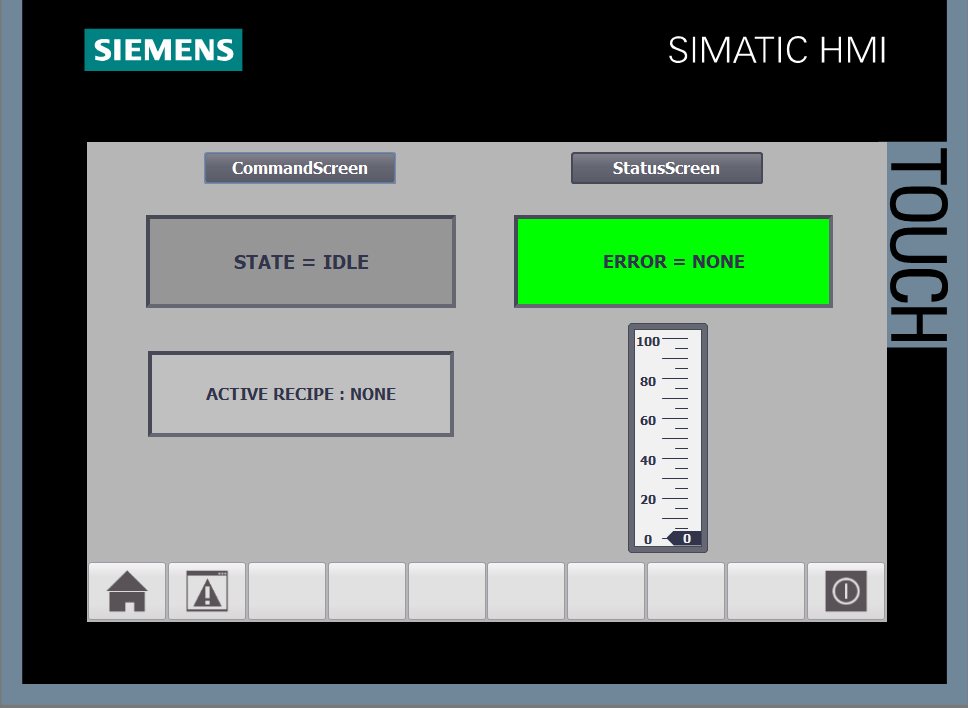
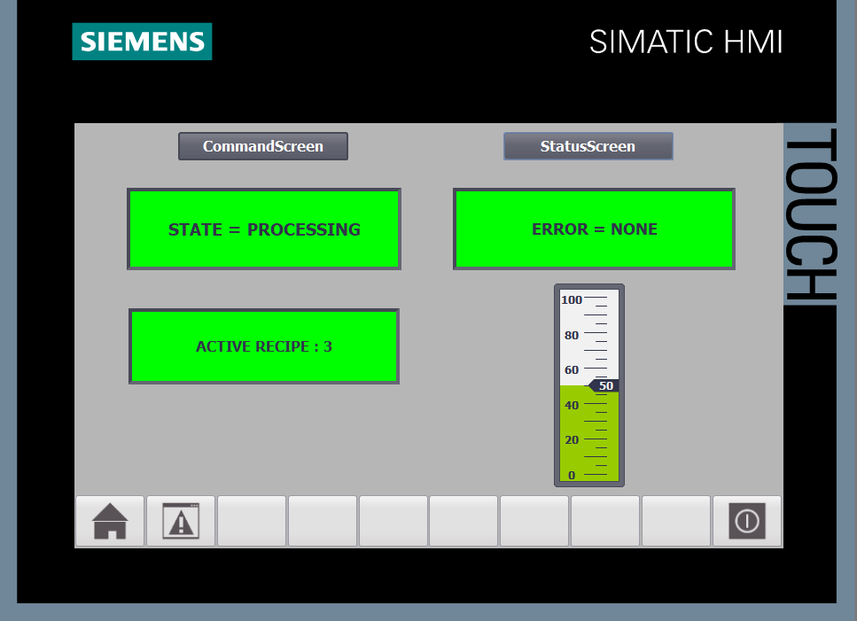
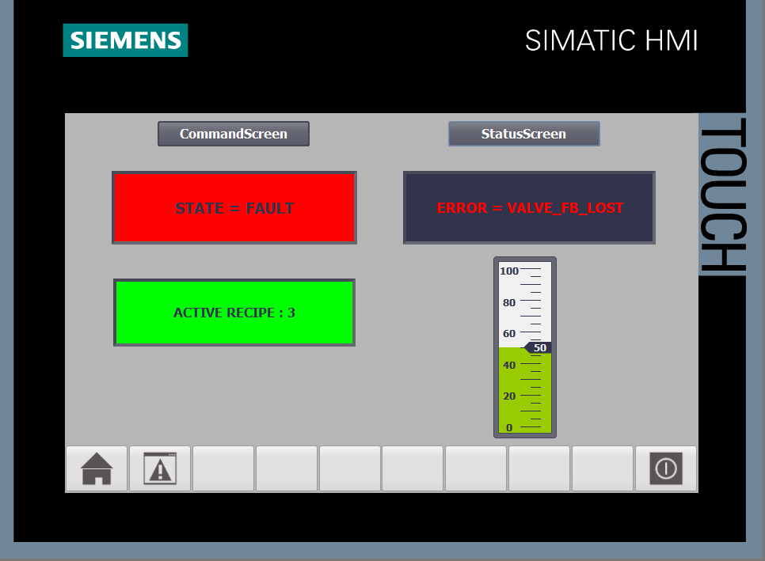
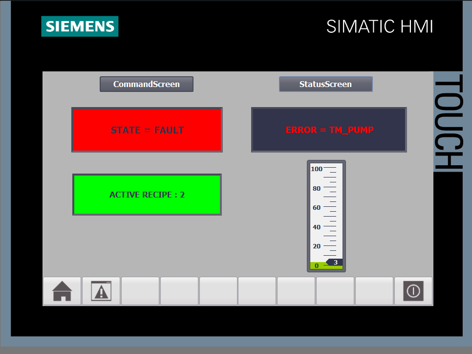
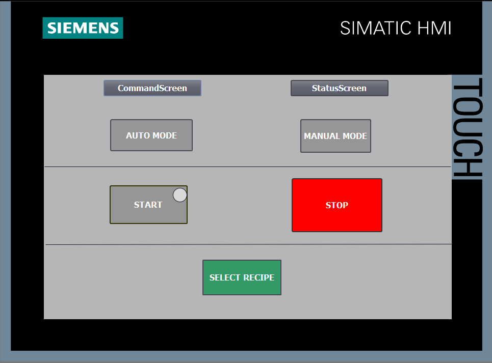
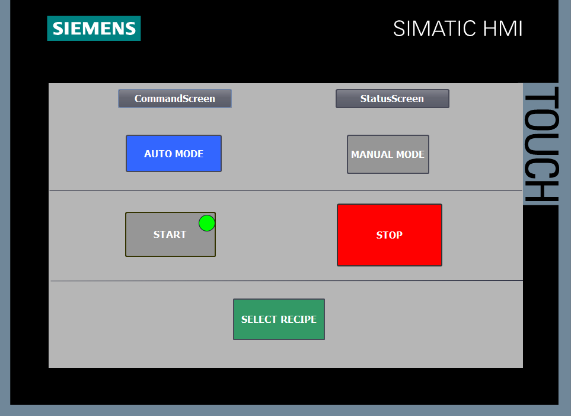
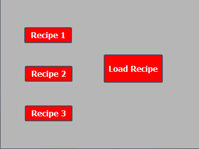
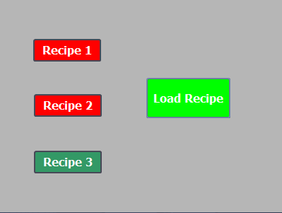

# tia-portal-tank-project
# Industrial Tank Automation System

## Overview

This project is an industrial automation system developed in Siemens TIA Portal using Structured Control Language (SCL) and WinCC HMI.

The system simulates an automated tank process with modular PLC architecture, including control logic, recipe management, and process simulation.

The system architecture is described in detail in the plc-architecture section

---

## System Features

- State machine-based 
- AUTO / MANUAL operating modes
- Recipe management system
- Pump and valve supervision with feedback monitoring
- Alarm and fault handling system
- Tank level simulation
- HMI integration (WinCC)
- Separation between control logic and process simulation

---

## Main Components

### [FB_Tank](function_blocks/fb_tank)
Core control logic of the system:
- State machine implementation
- Mode management (AUTO / MANUAL)
- Actuator control (pump, valve)
- Timeout and fault detection
 

### [FB_Tank_Simulation](function_blocks/fb_tank_simulation)
Simulates the physical process:
- Tank level dynamics
- Sensor behavior
- Fault simulation (stuck actuator, sensor failure)

### [FB_Supervision](fb_supervision)
- Recipe Loading

## HMI Interface

The HMI is divided into three screens:

- PROCESS OVERVIEW: real-time process visualization

 

  
  

ALARMS / FAULTS 

  
  

- CONTROL PANEL: operator commands (start/stop, mode selection, recipe selection)

  
  

- RECIPE SELECTION POPUP (FROM CONTROL PANEL)
  

  
  

---

## Technologies

- Siemens TIA Portal
- WinCC
- SCL (Structured Control Language)
- PLC State Machine Design
